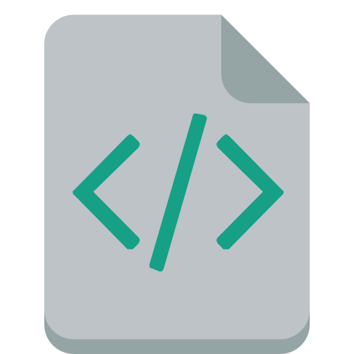
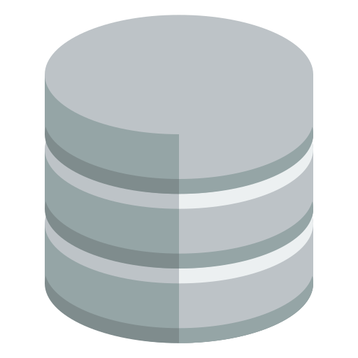

# Company Information System

This is a full-stack application with a React front-end and a java back-end.
Track your company's information with this application. You can add, edit, and delete employees.

---

</br>
<table align="center">
<tr>
    <td>
        <p align="center">
            <a href="./frontend/README.md"></a>
        </p>
    </td>
    <td>
        <p align="center">
            <a href="./backend/README.md"></a>
        </p>
    </td>
</tr>
    <tr>
        <td><p align="center">Frontend</p></td>
        <td><p align="center">Backend</p></td>
    </tr>
</table>
</br>

---

## Table of contents

- [Installation](#installation)
- [Technologies](#technologies)
  - [Backend](#backend)
  - [Frontend](#frontend)

---

### Installation

1. Clone the repo

```sh
git clone https://github.com/Polcsi/company-information-java.git
```

> **REQUIREMENTS**: `Java 21`, `Maven`, `Node.js`, `npm`, `git`

2. Frontend installation. You can find more information in the [frontend documentation](./frontend/README.md#installation).

3. Backend installation. You can find more information in the [backend documentation](./backend/README.md#installation).

---

### Technologies

This project uses the following technologies:

#### Backend:

- Java
- Spring Boot
- Spring Validation
- Spring Web
- Maven
- MongoDB

#### Frontend:

- React
- React Router
- TypeScript
- Axios
- Formik

Read more about the technologies in the [frontend](./frontend/README.md#technologies) and in the [backend](./backend/README.md#technologies) docs.

---
