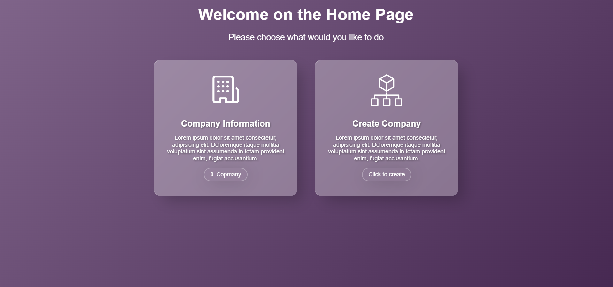
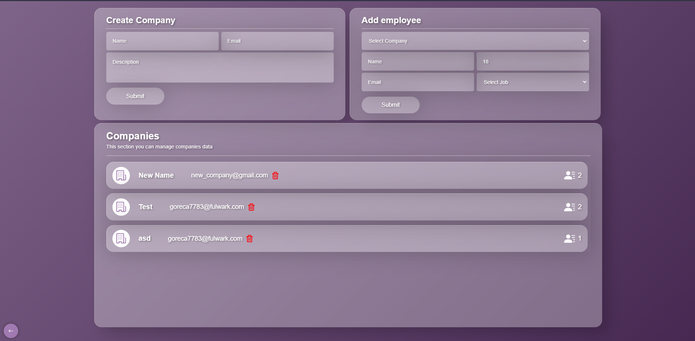
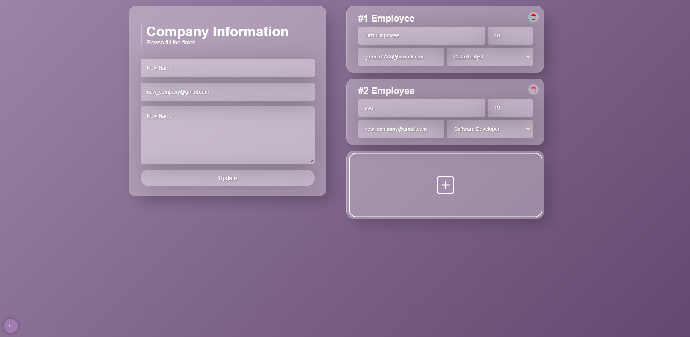
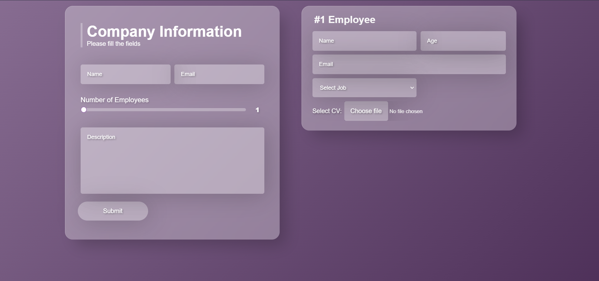
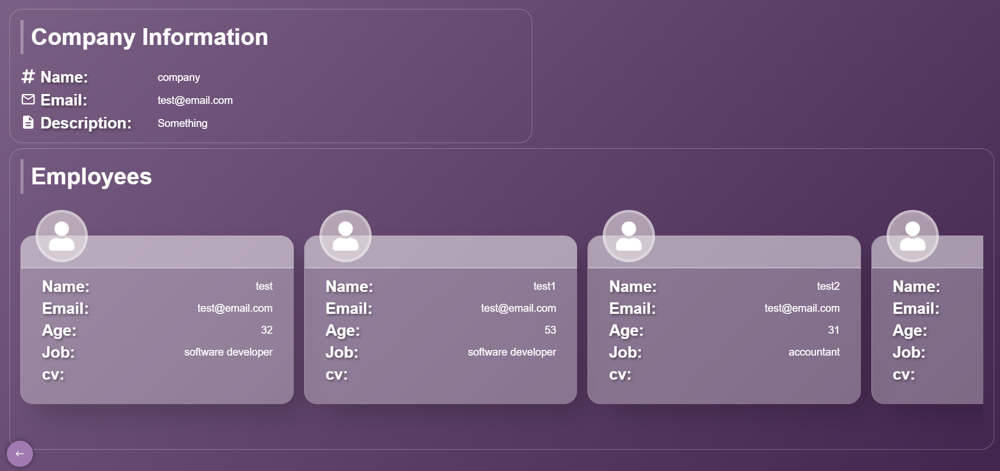

# Frontend documentation

This is a React **Frontend** Application which collect company and employees information. You can find the documentation of the backend [here](../backend/README.md).

Application seperated six pages:

- [/](#home-page) home page
- [/companies](#companies-companies) where the user be able to update, delete and create company and more
- [/companies/:id](#update-company-companiesid) where the user be able to update company information
- [/create company](#create-company-create-company) where the user be able to create company
- [ /results](#results-page-results) where after the form submission the data going to be represented
- [/\*](#error-page) error page: when the user navigates to a non-implemented page

The pages have very clean looking and designed make the page easy to use for the user. Every single page is responsive so it will look good on mobile and large screens.

## Table of contents

- [Table of contents](#table-of-contents)
  - [Installation](#installation)
  - [Technologies](#technologies)
    - [Libraries](#libraries)
  - Pages
    - [Home Page](#home-page)
    - [Companies](#companies)
    - [Update Company](#update-company)
    - [Create Company](#create-company)
    - [Results Page](#results-page)
    - [Error Page](#error-page)

---

### Installation

1. Navigate to frontend directory

```bash
cd frontend
```

2. Install dependencies

```bash
npm install
```

3. Start the application

```bash
npm run dev
```

---

### Technologies

</br>
<table align="center">
<tr>
    <td>
        <p align="center">
            
        </p>
    </td>
    <td>
        <p align="center">
            
        </p>
    </td>
    <td>
        <p align="center">
           
        </p>
    </td>
</tr>
    <tr>
        <td><p align="center">React</p></td>
        <td><p align="center">Vite</p></td>
        <td><p align="center">TypeScript</p></td>
    </tr>
</table>

#### Libraries

| Library            | Purpose                              |
| ------------------ | ------------------------------------ |
| **Axios**          | Fetching data from the backend       |
| **Formik**         | Form handling                        |
| **Yup**            | Form validation                      |
| **React Toastify** | Displaying toast messages            |
| **React Icons**    | Icons                                |
| **Lottie**         | Animations                           |
| **swr**            | Data fetching, caching, revalidation |

---

### Home Page "/"

It contains **two section**s, one for displaying company information and another for creating a new company. The user can decide wether want to create or displaying companies.



### Companies "/companies"

The companies page contains a table which represents the companies. The table has a delete button which is able to delete the company from the table. Table rows is clickable and it navigates to the [update company page](#update-company-companiesid).

- There is a section on the top of the page where the user be able to create a new company. _The user can give the company name, email address, number of employees and a short description about company._
- There is another section on the top of the page where the user be able to add a new employee to the existing companies. _The user can give the employee name, age, email, job._



### Update Company "/companies/:id"

The update company page includes a company form section where the user be able to update the company name, email address, short description about company. In the employees section the user will be able to update each employee name, age, email, job. <br/></br>_The user can submit the forms with the submit button in the company section. After the user clicks on the submit button and all the required fields is filled then it navigates to the results page where the entered values will be represented._



---

### Create Company "/create-company"

The create company page includes a company form section where the user be able to give the company name, email address, number of employees and a short description about company.
<br/><br/>Furthermore there is an employees section on the home page which is **dinamically rendered** it depends on how many number of employees were given in the comapny section. In the employees section the user will be able to give the employee name, age, email, job and cv pdf file. The user can submit the forms with the submit button in the company section. _After the user clicks on the submit button and all the required fields is filled then it navigates to the results page where the entered values will be represented._



---

### Results Page "/results"

The results page represents the submitted data. There is a section for company information and there is a section for employees. The page left bottom corner there is a button which navigates back to the home page.



---

### Error Page "/\*"

Error page just simply says that "404, page not found" on the page and provides a button for the user to be able to navigate back to the home page.


